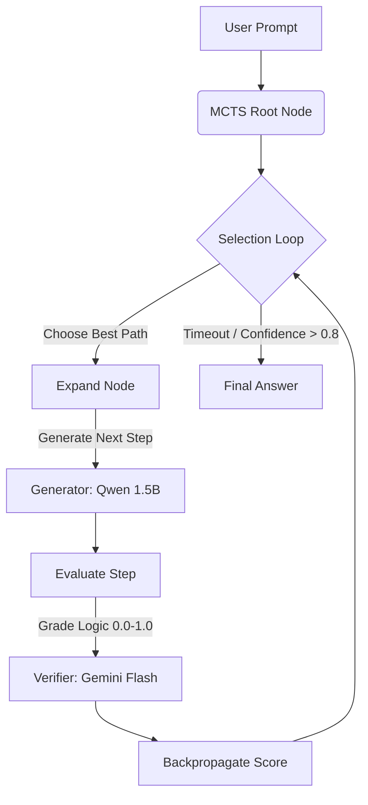

# Nano-Reason: Inference-Time Scaling with MCTS 

**Nano-Reason** is a lightweight implementation of **System 2 thinking** for Small Language Models (SLMs).

Inspired by recent advancements in inference-time scaling (e.g., OpenAI o1), this project wraps a small, local generator (`Qwen-2.5-Math-1.5B`) in a **Monte Carlo Tree Search (MCTS)** loop. It uses a stronger, external model (`Google Gemini 1.5 Flash`) as a reward function/verifier to guide the small model through complex math problems via self-correction and backtracking.

## Key Features
* **Generator:** Uses `Qwen/Qwen2.5-Math-1.5B-Instruct` (running locally via HuggingFace).
* **Verifier:** Uses `Gemini 1.5 Flash` (via API) to score intermediate reasoning steps.
* **Algorithm:** MCTS with UCT (Upper Confidence Bound for Trees) to balance exploration of new logical paths vs. exploitation of high-scoring partial solutions.
* **Dynamics:** Enables a 1.5B parameter model to "think" for minutes, correcting errors that would cause it to fail in a standard zero-shot setting.

## Architecture



## Benchmark Results (GSM8K)

Tested on a randomized subset of the GSM8K Test Set (N=50).

| Method | Accuracy | Avg. Time Per Problem | Description |
| :--- | :--- | :--- | :--- |
| **System 1 (Zero-Shot)** | 82% | ~8s | Standard generation. Fast but prone to logical drifts. |
| **System 2 (MCTS)** | 84% | ~150s | Tree search with backtracking. Higher accuracy, significantly higher compute cost. |

## Graph Visualization

By setting `construct_dot` in the `selection_loop` method, you can generate a graphical visualization of the logic paths.


### Analysis of Results
* **Base Model Saturation:** The 1.5B model is surprisingly capable at GSM8K (82% baseline), leaving little room for MCTS to improve on "standard" arithmetic problems.
* **The "Verifier Bottleneck":** The accuracy gain was capped by the Verifier's strictness. In several failure cases, MCTS found a wrong answer, but the Verifier hallucinated a high score (0.9), causing the agent to accept the error confidently.
* **Inference Trade-off:** We observed a successful compute-for-accuracy exchange. On complex logic traps (e.g., Candice's Post-it Notes), MCTS successfully backtracked out of incorrect initial assumptions where Zero-Shot failed.

## Installation & Usage

### Prerequisites
* Python 3.10+
* A Google Gemini API Key

### Setup
1. **Clone the repository**
   ```bash
   git clone https://github.com/yourusername/nano-reason.git
   cd nano-reason
   ```

2. **Install dependencies**
   ```bash
   pip install torch transformers accelerate bitsandbytes google-generativeai datasets tqdm
   ```

3. **Set Environment Variables**
   Create a `.env` file or export your key:
   ```bash
   export GEMINI_API_KEY="your_api_key_here"
   ```

### Running the Benchmark
To replicate the results on GSM8K:
```bash
python -m experiments.benchmark
```
* `max_iter` defaults to 8.
* `max_length` per step defaults to 128 tokens.

## Future Work
To scale this from a +2% boost to a +10% boost, the following improvements are planned:
* **Harder Datasets:** GSM8K is becoming "saturated" (too easy) for modern 1.5B models. Moving to AIME or MATH (Level 4-5) will provide a better signal for System 2 capabilities.
* **Temperature Scheduling:** Currently, the generator runs at low temperature. Increasing temp during the Expansion phase of MCTS will encourage more diverse creative reasoning paths for the tree to explore.
* **Verifier "Chain of Thought":** Instead of asking Gemini for a scalar score (0.0-1.0), we will force the Verifier to output its own reasoning trace before scoring to reduce false positives (hallucinated high scores).

## License
MIT License.
